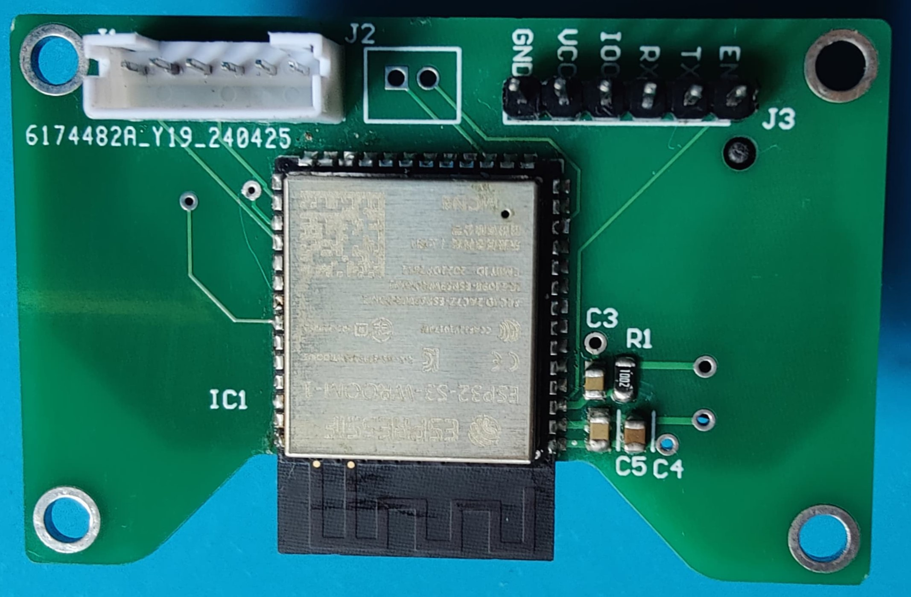

# IoT-Based Commercial Freezer Monitoring System

    

IoT Based commercial freezer monitoring system is designed to address the challenges faced by dairy item 
suppliers, laboratories, and pharmacies in ensuring the quality of stored products in freezers provided 
to sellers. This system provides real-time monitoring of freezer conditions, including 
temperature level, humidity, and pressure levels, to ensure that products are stored at optimal 
conditions.

## Features
- This system contains two main units
    1. Main Unit - Installed outside the freezer
    2. Sub Unit - Installed inside the freezer
- Use BME280 sensor to measure temperature, humidity, and pressure.
- Use ESP-NOW to transmit data between two units
- Use Sim800L module, which enables cellular communication to send data to the database when Wi-Fi is not available

## PCB Design
The PCB is designed as a two-layer board using **Altium Designer**.
  

| **PCB - Main Unit** | **PCB - Sub Unit** |
|:--:|:--:|
|  |  |

  

| **Soldered PCB - Main Unit** | **Soldered PCB - Sub Unit** |
|:--:|:--:|
|  |  |

Schematics and PCB Design files can be found <a href="PCB Files">here</a>.

## Enclosure Design
Enclosure is designed using **SOLIDWORKS**.

  

| **Enclosure - Main Unit** | **Enclosure - Sub Unit** |
|:--:|:--:|
|  |  |

Solidworks Design files can be found <a href="Enclosure">here</a>.

## Coding
To develop the firmware we used **ESP-IDF**.

Codes for the firmware development can be found <a href="Codes">here</a>.
